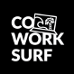

# Wijnand Karsens

Full Stack TypeScript Developer & Founder

Address: Kleine Beer 40, 9742 RJ, Groningen

Phone: (+31) 68190 4650

Email: wijnand@karsens.com

Website: www.codefromanywhere.com

## Skills

### Web Development

- JavaScript / TypeScript
- React
- Next.js
- HTML
- (S)CSS

### App Development

- JavaScript / TypeScript
- React Native
- Expo.io

### Full Stack MVP Development

- All of the above
- Node.js
- MySQL

### Other

- Team Work
- Marketing
- Entrepreneurship
- Product Ownership
- Test Driven Development

## Interests

- (Kite)surfing
- Tabletop games
- Travel
- Going out
- Writing
- Hiking

# Profile

I am am motivated individual that prides himself in having a lot of experience in (full-stack) web- and app-development, working extremely fast and creating high-quality end-products.

The coming years my plan is to use my coding and leadership skills to develop humane mobile- and web-apps. I plan to get Senior Developer, Lead Developer, and CTO roles while growing my Software Development Agency.

# Education

- **2017: Diploma** - University Of Groningen (RUG), Bachelor, Artificial Intelligence
- **2012: Diploma** - VWO, Zernike College Westerse Drift, Haren, The Netherlands

# Experience

<b>CoworkSurf</b>

    
Timeframe

    
September 2021 - present

    
Position

    
Chief Technology Officer (CTO) & Co-Founder

    
Stack

    
React, Next.js, Node.js (Full Stack TypeScript)

Probably the project I’m most proud of. Together with the 3 other founders, within one month I have successfully launched the MVP website: a booking platform for shared housing for remote workers at surf locations. The hardest part of this app was the complex logic of booking accommodation, the Stripe integration, and the optimal image delivery. Have a look at www.coworksurf.com

<b>CoworkSurf</b>

    
Timeframe

    
September 2021 - present

    
Position

    
Chief Technology Officer (CTO) & Co-Founder

    
Stack

    
React, Next.js, Node.js (Full Stack TypeScript)

Probably the project I’m most proud of. Together with the 3 other founders, within one month I have successfully launched the MVP website: a booking platform for shared housing for remote workers at surf locations. The hardest part of this app was the complex logic of booking accommodation, the Stripe integration, and the optimal image delivery. Have a look at www.coworksurf.com

<b>CoworkSurf</b>

    
Timeframe

    
September 2021 - present

    
Position

    
Chief Technology Officer (CTO) & Co-Founder

    
Stack

    
React, Next.js, Node.js (Full Stack TypeScript)

Probably the project I’m most proud of. Together with the 3 other founders, within one month I have successfully launched the MVP website: a booking platform for shared housing for remote workers at surf locations. The hardest part of this app was the complex logic of booking accommodation, the Stripe integration, and the optimal image delivery. Have a look at www.coworksurf.com

